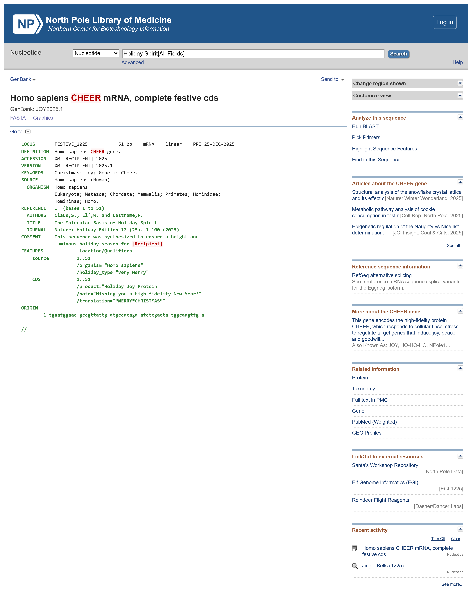

# 🎄 GenBank Holiday Card Generator

A festive tool for generating holiday greetings in the format of an NCBI Nucleotide record.

## Overview

Are you tired of sending normal Christmas cards? Do you want to wish your lab partner a "Happy New Year" using a custom Open Reading Frame?

The GenBank Holiday Editor allows you to input custom text and DNA sequences to generate a realistic-looking GenBank flat file record. It mimics the interface of the NCBI Nucleotide database, complete with accession numbers, joyous keywords, and translation features.

## Rationale

I built this as a highly over-engineered solution to making Christmas cards to match the [3D printed DNA molecules](https://makerworld.com/en/models/570981-dna-model-adenine-thymine-cytosine-guanine) I made for my lab. I did not create that model, only printed it.

The nucleotide sequences represent their initials (using mass spec ambiguity codes and other hacks where necessary), so I made this card to explain the molecular sequence. I thought I would share the template I used to do this.

## Features

- **Real-Time Editing**: Input recipient names, years, and authors, and watch the GenBank record update instantly.
- **Dynamic Accession Numbers**: Automatically generates accession numbers based on the recipient's name (e.g., XM-GRANDMA-2025.1).
- **DNA Translation**: Type in your raw DNA sequence, and the tool automatically translates it into the corresponding Amino Acid sequence in the /translation field using the Standard Genetic Code.
- **Sequence Formatting**: Automatically formats your raw nucleotide string into the standard, numbered GenBank block format (60 bp per line).
- **Custom Metadata**:
  - Change the "Product" name (e.g., "Holiday Joy Protein").
  - Add custom `/note` qualifiers.
  - "Festive" references throughout the page (e.g., JOURNAL Nature: Holiday Edition).
- **High-Res Export:** One-click download of the record as a PNG image, perfect for emailing or printing.

## Usage

**1. Recipient:** Enter the name of the person receiving the card.
**1. Authors:** Add yourself and your "collaborators" (e.g., Claus, S.).
**1. DNA Sequence:** Paste a nucleotide sequence.
**1. Customize:** Add a note (e.g., "Wishing you high-fidelity PCR results").
**1. Export:** Click "Download High-Res PNG" to save your card.

## Example

Here is the default export as a PNG file:

## Technical Details

**Dependencies**: Uses html-to-image for DOM capture and export.
**Logic**: Contains a client-side codon table to perform real-time translation of DNA strings to Protein strings.

## Disclaimer

This is a parody project. It is intended for entertainment and holiday purposes only. It is not affiliated with, endorsed by, or connected to the National Center for Biotechnology Information (NCBI), the National Library of Medicine (NLM), or the National Institutes of Health (NIH).

MIT License - feel free to fork and make it even more festive!

## AI use

I used LLMs extensively to build this. I made every effort to proofread and sanity check, and also remove anything I could to strip down the GenBank source HTML.

I also take no credit for the jokes - that's all Gemini. I wish I were that funny.